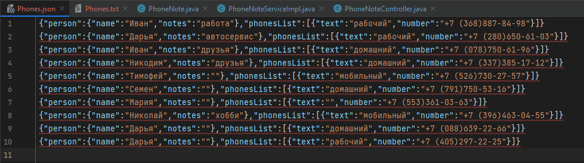

# От простого к практике

Создать телефонный справочник с возможностью импорта и экспорта данных в нескольких форматах. 
под форматами понимаем структуру файлов, например:

- в файле на одной строке хранится одна часть записи, пустая строка - разделитель

Скриншот 

